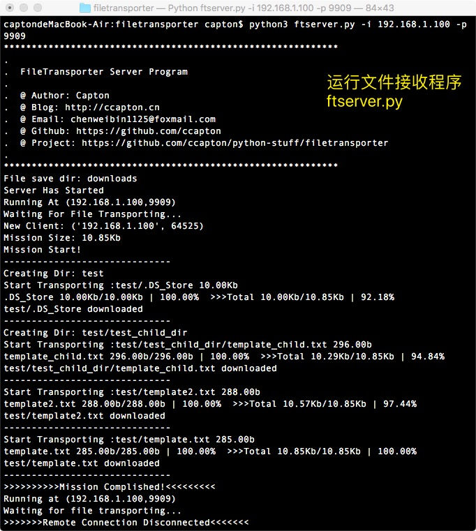
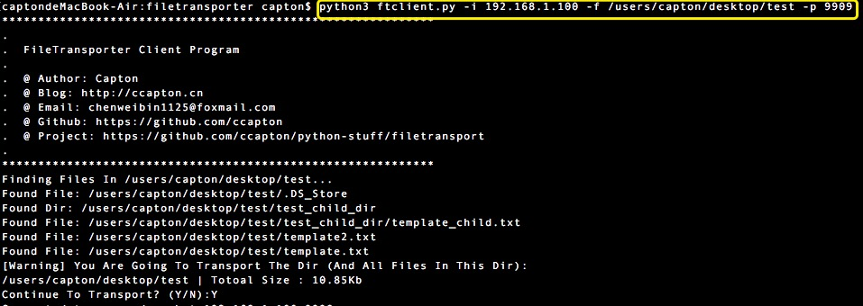

# FileTransporter

### 这是一个基于socket(TCP)的文件(夹)传输程序
 
### `预览效果`


##

### 0、环境搭建
在virtualenv环境下，cd 进入 requirements.txt所在目录，执行以下指令完成所需模块的安装
```python
pip install -r requirements.txt
```


### 1 、ftserver.py ：**接收端程序**
 
### `基本用法`
```python
python3 ftserver.py 
```
默认主机地址：计算机本地ip （例如 '192.168.1.100'）,  默认下载目录： downloads,

默认工作端口：9997（传输文件数据）、9998（传输程序指令）

### `详细用法` 
```html
-i 设置主机地址

-p 指定端口号

-d 指定文件（夹）保存路径 
```
### `示例`

先用 cd 命令 切换到 ftserver.py 所在文件夹，然后：
```python
python3 ftserver.py -i 192.168.1.100 -p 9909 -d /users/Capton/downloads
```

### `参数解释`
- 在局域网下，**-i** 地址参数可缺省（程序里默认指定了本地ip）
- -p 端口参数可自由设置 （9998除外， 这是传输指令的端口号）
- -d 文件保存目录页可自由设置

### `效果`
 


### 2 、ftclient.py ：**发送端程序**
### `基本用法`
```python
python3 ftclient.py -i <主机名(ip)> -f <文件（夹）路径>
```
局域网内下，填目标主机名或本地ip
### `详细用法` 
```html
-i 设置接收方主机名称（地址），必要参数

-p 指定接收方服务端口号 ，可选参数

-f 指定要发送的文件（夹）路径 ，必要参数
```
### `示例`

先用 cd 命令 切换到 ftclient.py 所在文件夹，然后：
```python
python3 ftclient.py -i 192.168.1.100 -p 9909 -f /users/Capton/desktop/test
```


### `效果`
 

## 注意
运行接收端程序，需要一个能访问的地址，也即是说最好是局域网内进行文件传输工作，因为局域网本地ip都是可以直接访问的，若是在公共网络传输文件，必须知道接收方主机的公网ip和内网ip。

例如我现在用到接收方主机是腾讯云的主机，内网ip是10.135.xxx.xxx,公网ip是111.120.xxx.xxx。该主机内，运行接收（服务）端程序

```python
python3 ftserver.py -i 10.135.xxx.xxx -d /home/ubuntu/downloads
```

而在你的主机运行发送（客户）端程序发送文件夹bilibili
```python
python3 ftclient.py -i 111.120.xxx.xxx -f /Users/capton/desktop/bilibili
```
因为腾讯云、阿里云等国内虚拟主机供应商是采用NAT地址转换对云主机进行地址分配的，所以按照我上面的步骤来运行两端程序才能连通
